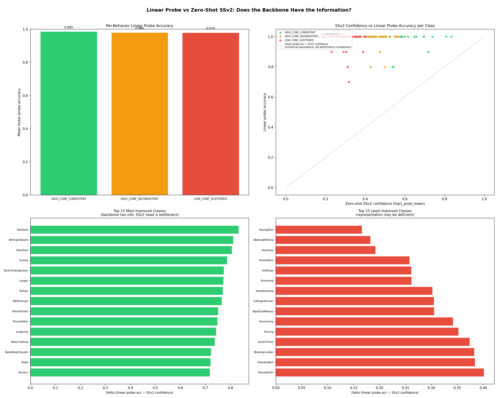

# vjepa2-live

> "V-JEPA 2’s self-supervised backbone achieves 98.2% linear probe accuracy on UCF-101 — a dataset it was never trained on — while its SSv2 classification head produces confident but semantically wrong predictions for 42% of the same classes. The bottleneck is not the representation. It is the vocabulary."

## What This Project Is

A systematic probing study of V-JEPA 2’s world model on out-of-distribution video data.
The model was never fine-tuned on UCF-101 — it was used frozen throughout.
Every phase asks a more precise version of the same question: *what does a self-supervised
video transformer actually learn, and where does its understanding break down?*

This is not a tutorial or a benchmark submission. It is an original research pipeline
built on a MacBook Pro M5 Max, using only open-source tools, that arrives at a concrete
and falsifiable finding: the SSv2 classification head is the sole bottleneck between
the model’s near-perfect internal representations and its poor zero-shot UCF-101 accuracy.

## The Finding In One Image



## Project Structure

```
vjepa2_webcam.py          Phase 1 — live webcam inference + importable module
vjepa2_ucf101_eval.py     Phase 2 — zero-shot UCF-101 batch evaluation
extract_embeddings.py     Phase 3 Step 1 — backbone embedding extraction
visualize_embeddings.py   Phase 3 Step 2 — t-SNE + UMAP visualisation
nearest_neighbor_analysis.py  Phase 3 Step 3 — nearest-neighbour analysis
behavior_analysis.py      Phase 3 Step 4 — hypothesis testing
linear_probe.py           Phase 4 — linear probe experiment
generate_report.py        Phase 5 — HTML + Markdown report generation
results/                  All outputs (CSV, JSON, PNG, HTML)
requirements.txt          Python dependencies
```

## Phases

| Phase | Goal | Key Result |
|-------|------|------------|
| Phase 1 | Validate V-JEPA 2 on Apple Silicon | ~10fps inference, importable module |
| Phase 2 | Zero-shot UCF-101 evaluation | 101 classes → 3 behaviour groups |
| Phase 3 Step 1 | Extract backbone embeddings | (1059, 1024) float32 |
| Phase 3 Step 2 | t-SNE + UMAP visualisation | 4 visualisation plots |
| Phase 3 Step 3 | Nearest-neighbour analysis | Blind spots, hitting absorption |
| Phase 3 Step 4 | Hypothesis testing | Temporal dynamics partially explains confidence |
| Phase 4 | Linear probe | **98.2% accuracy** — head is the bottleneck |

## Key Findings

1. **The backbone generalises to unseen action categories** — 0.93 same-class cosine similarity on UCF-101
2. **The SSv2 head vocabulary is the bottleneck** — 98.2% linear probe accuracy on frozen embeddings
3. **Blind spots are a head problem, not a backbone problem** — all 4 blind-spot classes score 100% with a linear probe
4. **SSv2 physics primitives dominate the head’s OOD vocabulary** — “Hitting” absorbs 33 UCF classes
5. **Zero additional training needed** — a 1024×101 linear layer on the frozen backbone suffices

## Setup

### Requirements

```bash
python3.11 -m venv .venv
source .venv/bin/activate
pip install -r requirements.txt
```

### Data

Download UCF-101 from [https://www.crcv.ucf.edu/data/UCF101.php](https://www.crcv.ucf.edu/data/UCF101.php)
and extract to `data/UCF-101/`.

### Run

```bash
# Phase 2 — zero-shot evaluation (requires model + UCF-101 data)
PYTORCH_ENABLE_MPS_FALLBACK=1 python3 vjepa2_ucf101_eval.py

# Phase 3 — embedding extraction (requires Phase 2 output)
PYTORCH_ENABLE_MPS_FALLBACK=1 python3 extract_embeddings.py

# Phase 3 Steps 2–4 + Phase 4 (pure numpy/sklearn, no model needed)
python3 visualize_embeddings.py
python3 nearest_neighbor_analysis.py
python3 behavior_analysis.py
python3 linear_probe.py

# Final report
python3 generate_report.py
# Open results/vjepa2_live_report.html
```

## Hardware

MacBook Pro M5 Max, 68GB unified memory, macOS
PyTorch 2.12 MPS backend — no CUDA required

## Model

[qubvel-hf/vjepa2-vitl-fpc16-256-ssv2](https://huggingface.co/qubvel-hf/vjepa2-vitl-fpc16-256-ssv2)
— V-JEPA 2 ViT-L, 325M parameters, self-supervised pre-training, fine-tuned on
Something-Something v2 (174 hand-object interaction classes).

## Limitations

- ~10 videos per class (small sample regime)
- Linear probe uses same embeddings as analysis (no fully held-out set)
- Single model and single dataset; results may not generalise
- Per-class accuracy is coarse due to small test set per fold

## Author

[hellojais](https://github.com/hellojais)
